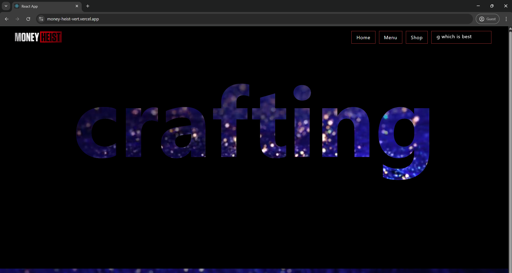

# 🧵 Crafting - Tailwind React App

Welcome to **Crafting**, my **first Tailwind CSS deployment** project!  
This is a simple, stylish front-end application built using **React** and **Tailwind CSS**, featuring a video background, responsive navigation bar, and modern UI components.

---

## 🚀 Features

- 🎥 Fullscreen autoplay looping video background
- 🖼️ Logo and custom branding with smooth layout
- 🌑 Dark-themed responsive navbar with hover effects
- 🔘 Interactive buttons with Tailwind transitions
- 💬 Scrolling marquee for dynamic user messages
- 🔤 Large, bold text overlay using Tailwind typography
- ✅ Fully styled with Tailwind CSS utility classes

---

## 🧱 Project Structure

```bash
.
├── public/
│   └── index.html
├── src/
│   ├── App.js             # Main app component
│   ├── App.css            # Global styles (if any)
│   ├── logo.svg           # Default React logo (unused)
│   ├── logo.png           # Custom brand logo
│   ├── vid1.mp4           # Background video
│   └── index.js           # React entry point
├── tailwind.config.js     # Tailwind configuration
├── postcss.config.js      # PostCSS setup for Tailwind
├── package.json           # Project metadata and scripts
└── README.md              # You are here :)
```

---

## 📦 Technologies Used

- **React** – Frontend JavaScript library
- **Tailwind CSS** – Utility-first CSS framework
- **HTML5 Video** – For autoplay loop background
- **PostCSS** – To compile Tailwind

---

## 🛠️ Getting Started

### 1. Clone the Repository

```bash
git clone https://github.com/yogeshwaranEvil/Tailwind_Css
cd Tailwind_Css
```

### 2. Install Dependencies

```bash
npm install
```

### 3. Start Development Server

If you’re using Vite:

```bash
npm run dev
```

If you’re using Create React App:

```bash
npm start
```

---

## 📸 Preview

Here’s what the UI looks like:



> Tip: You can take a screenshot after launching `npm run dev` and save it as `preview.png` in the root directory.

---

## 🧑‍💻 Author

- **Name**: Yogeshwaran R 
- **Project Type**: Front-End Practice Project  
- **Goal**: Learn Tailwind CSS with React by building a simple, sleek UI


---

## 🙏 Acknowledgements

- [Tailwind CSS Documentation](https://tailwindcss.com/docs)
- [React Official Docs](https://reactjs.org/)
- Inspiration from minimal and dark-themed UIs

---